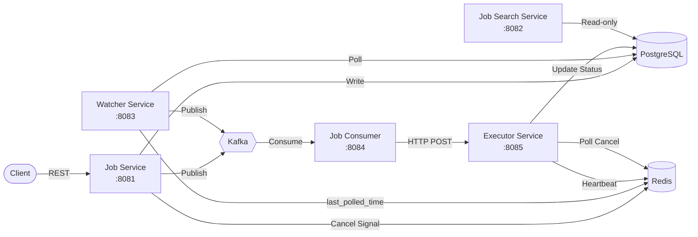

# MyJobScheduler

A distributed job scheduling system inspired by Airflow and Temporal, built with Java 21 microservices.

## Architecture



## Tech Stack

- **Language:** Java 21
- **Framework:** Spring Boot 4.0.6
- **Database:** PostgreSQL 16 (partitioned tables)
- **Cache/Signals:** Redis 7 (heartbeats, cancel signals)
- **Messaging:** Apache Kafka (Confluent 7.5.0)
- **Migrations:** Flyway (job-service only)
- **Containerization:** Docker Compose

## Services

| Service | Port | Role |
|---|---|---|
| job-service | 8081 | CRUD operations, job creation, cancel, runNow |
| job-search-service | 8082 | Read-only search, filtering, pagination, stats |
| watcher-service | 8083 | Polls for scheduled jobs, detects stuck jobs |
| job-consumer-service | 8084 | Consumes Kafka messages, dispatches to executor |
| executor-service | 8085 | Runs jobs, heartbeats, handles cancellation |

## How It Works

1. **Job Creation:** Client creates a job via `POST /v1/api/jobs` → stored as `SCHEDULED` in PostgreSQL, optionally published to Kafka.

2. **Scheduling:** Watcher service polls every 10s for jobs in a 5-minute window, marks them `QUEUED`, and publishes to Kafka's `run` topic.

3. **Dispatch:** Job consumer service consumes from Kafka and dispatches execution requests to the executor via HTTP.

4. **Execution:** Executor runs the job asynchronously, sends Redis heartbeats every 10s (30s TTL), and polls for cancel signals every 5s.

5. **Stuck Detection:** Watcher detects jobs stuck in `RUNNING` (no heartbeat update for 19s+) and publishes to the `retry` topic.

6. **Cancellation:** `POST /{id}/cancel` writes a `cancel:{jobId}` key to Redis. Executor detects it and marks the job `CANCELLED`.

## Quick Start

### Full Docker (all services)

```bash
docker compose up -d --build
```

### Local Development (infra in Docker, services on host)

```bash
# Start infrastructure
docker compose up -d jobscheduler-postgres jobscheduler-redis jobscheduler-zookeeper jobscheduler-kafka

# Run each service (separate terminals)
cd job-service && mvn spring-boot:run -Dspring-boot.run.jvmArguments="-Duser.timezone=Asia/Kolkata"
cd watcher-service && mvn spring-boot:run -Dspring-boot.run.jvmArguments="-Duser.timezone=Asia/Kolkata"
cd job-consumer-service && mvn spring-boot:run -Dspring-boot.run.jvmArguments="-Duser.timezone=Asia/Kolkata"
cd executor-service && mvn spring-boot:run -Dspring-boot.run.jvmArguments="-Duser.timezone=Asia/Kolkata"
cd job-search-service && mvn spring-boot:run -Dspring-boot.run.jvmArguments="-Duser.timezone=Asia/Kolkata"
```

## API Reference

### Job Service (8081)

| Method | Endpoint | Description |
|---|---|---|
| POST | `/v1/api/jobs` | Create a job |
| GET | `/v1/api/jobs/{id}` | Get job by ID |
| GET | `/v1/api/jobs/{id}/status` | Get job status |
| PUT | `/v1/api/jobs/{id}` | Update a job |
| POST | `/v1/api/jobs/{id}/cancel` | Cancel a job |
| POST | `/v1/api/jobs/{id}/runNow` | Trigger immediate run |

### Job Search Service (8082)

| Method | Endpoint | Description |
|---|---|---|
| GET | `/v1/api/jobs/search?name=&status=&page=0&size=20` | Search with filters |
| GET | `/v1/api/jobs/{id}` | Get job by ID |
| GET | `/v1/api/jobs/{id}/runs` | Get run history |
| GET | `/v1/api/jobs/stats` | Job counts by status |

### Executor Service (8085)

| Method | Endpoint | Description |
|---|---|---|
| POST | `/v1/api/execute` | Execute a job (called by consumer) |

## Example Usage (PowerShell)

```powershell
# Create a job
[System.IO.File]::WriteAllText("C:\Users\anubh\MyJobScheduler\body.json", '{"name": "test-job", "scheduleTime": "2026-06-06T15:10:00", "scheduleType": "ONE_TIME", "payload": "duration-15"}')
curl.exe -X POST http://localhost:8081/v1/api/jobs -H "Content-Type: application/json" -d "@C:\Users\anubh\MyJobScheduler\body.json"

# Check stats
curl.exe http://localhost:8082/v1/api/jobs/stats

# Search jobs
curl.exe "http://localhost:8082/v1/api/jobs/search?status=SUCCESS&page=0&size=5"
```

## Data Model

- **jobs** — Partitioned by `schedule_time`, composite PK `(id, schedule_time)`, UUIDs
- **job_runs** — Run history per job, indexed by `job_id`, no FK (composite PK constraint)

## Design Decisions

- **Composite PK:** PostgreSQL partitioned tables require the partition key in the primary key — all queries include `schedule_time`.
- **No shared libraries:** Each service has its own entity copies. Avoids coupling for a portfolio-scale project.
- **Redis for signals:** Heartbeats (TTL-based liveness) and cancel signals (polled by executor) — simple, fast, no DB polling overhead.
- **Kafka for dispatch:** Decouples scheduling from execution. `run`, `retry`, and `dead` topics with 10 partitions each.
- **Watcher pattern:** Centralized polling beats per-job timers — simpler, easier to reason about, naturally handles clock skew.